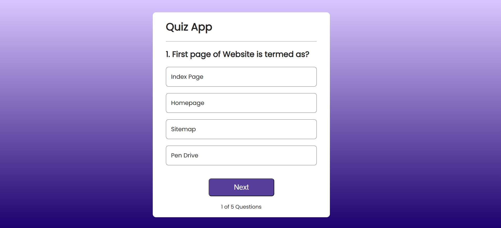
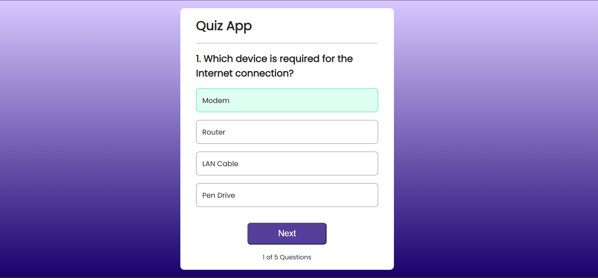
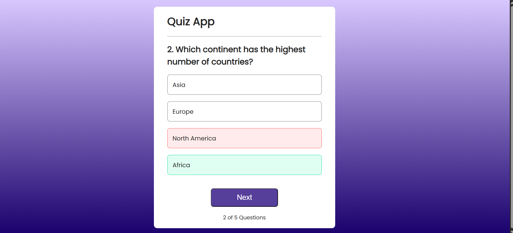
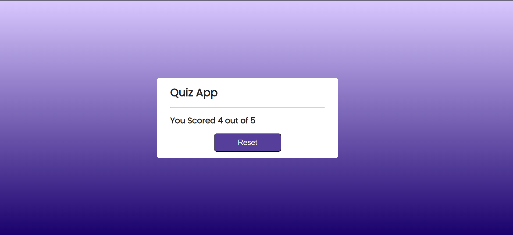

# Quiz App Using React

[](LICENSE)
[](https://reactjs.org/)

## Table of Contents
- [Overview](#overview)
- [Features](#features)
- [Screenshots](#screenshots)
- [Technologies Used](#technologies-used)
- [Installation](#installation)
- [Usage](#usage)
- [Contributing](#contributing)
- [Future Enhancements](#future-enhancements)
- [License](#license)

---

## Overview
This is a **Quiz Application built with React**.  
Users can attempt quizzes, get instant feedback, and view their scores.  
The app is **responsive, interactive, and easy to customize**.

---

## Features
- Multiple-choice questions with instant feedback  
- Score tracking at the end of the quiz  
- User-friendly and responsive UI  
- Easy to add new quizzes and questions  

---
 

### Screenshots

**Home Page**  
  

**Correct Answer**  
  

**Wrong Answer**  
  

**Results Page**  
  


---

## Technologies Used
- **React.js** – Frontend framework  
- **JavaScript (ES6)** – Logic  
- **CSS** – Styling  
- **Git & GitHub** – Version control  

---

## Installation
1. Clone the repository:

```bash
git clone https://github.com/ASK-18/Quiz-App-Using-React.git
cd Quiz-App-Using-React
```
2.Install dependencies:
```bash
npm install
```

3.Start the application:
```bash
npm start
```
## Usage
* Select a quiz  
* Answer the questions  
* View your score at the end  
* Optionally, add new quizzes in the `data` or `questions` folder  

---

## Contributing
Contributions are welcome!  

1. Fork the repository  
2. Create a new branch: `git checkout -b feature-name`  
3. Commit changes: `git commit -m "Add feature"`  
4. Push to branch: `git push origin feature-name`  
5. Open a Pull Request  

---

## Future Enhancements
* Add **timers** for quizzes  
* Add **user authentication and profiles**  
* Store results in a **database or backend**  
* Add **categories and difficulty levels**  

---

## License
This project is licensed under the **MIT License** – see the [LICENSE](LICENSE) file for details.
